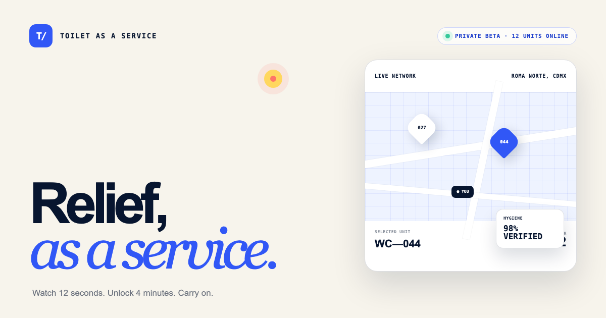

<p align="center">
  
</p>

<h1 align="center">Toilet as a Service</h1>

<p align="center">
  Infraestructura pública financiada por atención.<br />
  Mira 12 segundos. Desbloquea 4 minutos.
</p>

<p align="center">
  <a href="https://toilet-as-a-service.juliosuas.chatgpt.site"><strong>Live experience</strong></a>
  ·
  <a href="https://toilet-as-a-service.juliosuas.chatgpt.site/press">Press kit</a>
  ·
  <a href="docs/launch.md">Launch copy</a>
</p>

<p align="center">
  <a href="https://github.com/juliosuas/toilet-as-a-service/actions"></a>
  
  
  
</p>

---

Toilet as a Service (TaaS) is an interactive product satire about the attention economy reaching physical infrastructure. It presents a fictional network of premium public restrooms where access is exchanged for an unskippable ad.

The experience is intentionally credible. The service is not real.

## Why this exists

Digital products routinely exchange convenience for attention, personal data, or recurring payments. TaaS takes that logic one uncomfortable step further: what happens when a basic human need becomes ad inventory?

The project is designed to be understood in seconds, experienced in under a minute, and discussed long after the tab is closed.

## Product flow

```text
Find a nearby unit → Watch a 12-second sponsor message → Unlock 4 minutes → Receive a shareable relief receipt
```

The simulation runs entirely in the browser. It does not request location, collect personal data, process payments, or operate physical facilities.

## Experience

- Cinematic, image-led launch page
- Functional 12-second access simulation
- Accessible escape and priority-access paths
- Share-ready post-demo receipt
- Dedicated press room with prepared launch copy
- Dynamic Open Graph and Twitter metadata
- Responsive layouts for mobile and desktop

## Technical overview

| Layer | Technology |
| --- | --- |
| Application | Next.js 16, React 19, TypeScript |
| Build/runtime | Vinext, Vite, Cloudflare Workers |
| Persistence | Drizzle ORM scaffold (not used by the satire flow) |
| Testing | Node test runner + production render assertions |
| Quality | ESLint, TypeScript strict checks, CI |
| Hosting | OpenAI Sites |

## Local development

### Requirements

- Node.js 22.13 or newer
- npm 10 or newer

### Setup

```bash
git clone git@github.com:juliosuas/toilet-as-a-service.git
cd toilet-as-a-service
npm install
npm run dev
```

The development server prints its local URL when ready.

### Validation

```bash
npm run lint
npx tsc --noEmit
npm test
```

`npm test` creates a production build and verifies the rendered product experience and social metadata.

## Project structure

```text
app/
├── page.tsx          # Main product experience and access simulation
├── press/page.tsx    # Press room and launch copy
├── layout.tsx        # Metadata and application shell
└── globals.css       # Campaign art direction and responsive system
public/
├── campaign-hero.png # Primary campaign visual
└── og.png            # Social sharing card
docs/
└── launch.md         # Launch copy and publishing notes
tests/
└── rendered-html.test.mjs
```

## Design principles

1. **Explain the premise before the joke.** The product should read as plausible infrastructure at first glance.
2. **One visual idea, fully committed.** The campaign uses black, warm white, and signal yellow instead of generic SaaS decoration.
3. **Make the critique experiential.** The unskippable countdown is the argument.
4. **Disclose clearly.** Satire must remain visible, and the simulation must never impersonate a real service or collect user data.

The launch visual was art-directed for this project and generated with Higgsfield AI. Its visible platform mark is intentionally retained.

## Privacy and ethics

TaaS is a fictional, independent art and software project.

- No restroom network exists.
- No user accounts or payments are accepted.
- No personal information, precise location, or behavioral profile is collected.
- All operating metrics, testimonials, unit identifiers, and commercial claims are fictional.
- The satire disclosure appears in the interface, press room, metadata, and repository.

## Contributing

Focused improvements are welcome. Before opening a pull request:

1. Keep the premise legible in under five seconds.
2. Preserve the visible satire disclosure and privacy guarantees.
3. Run lint, type checks, and the production test suite.
4. Include desktop and mobile screenshots for visual changes.

## Status

Active conceptual release. The website is public; the service is fictional.

---

<p align="center"><strong>No stalls. No payments. No data collection.</strong><br />Ciudad de México · 2026</p>
